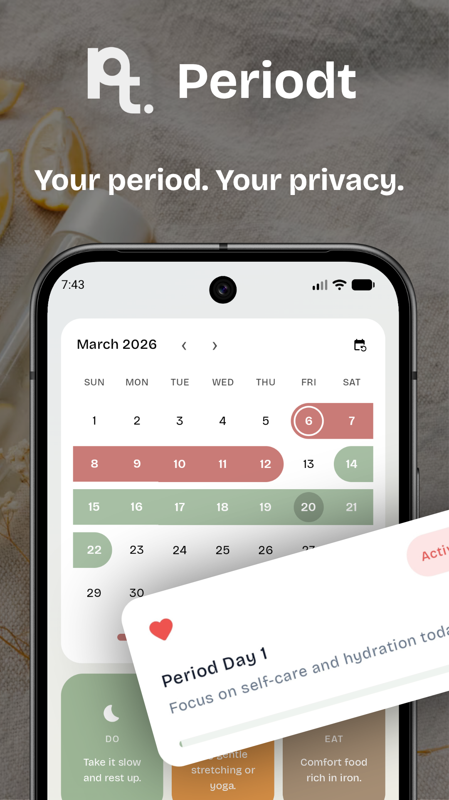
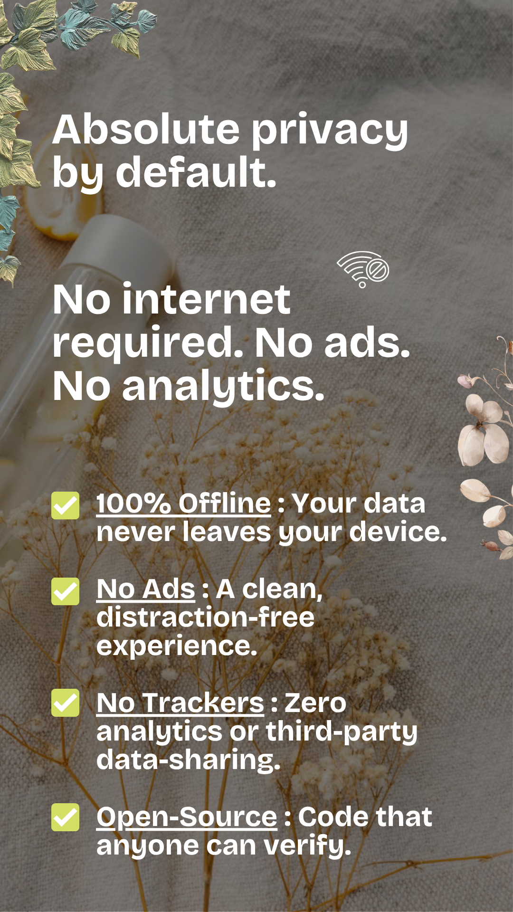
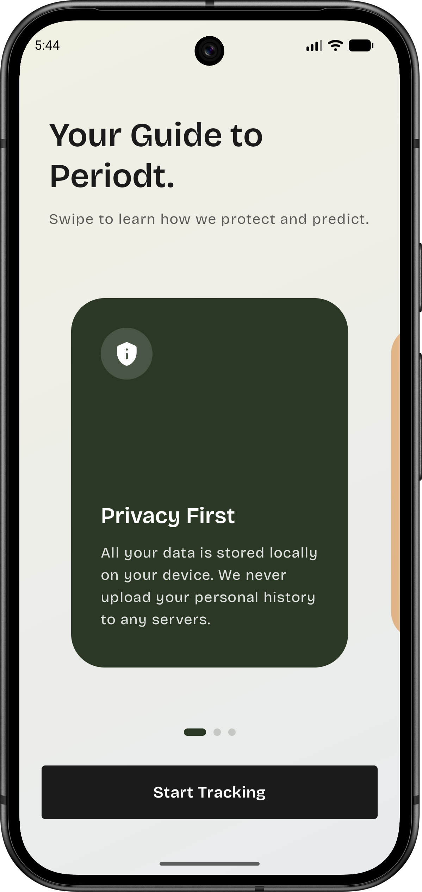
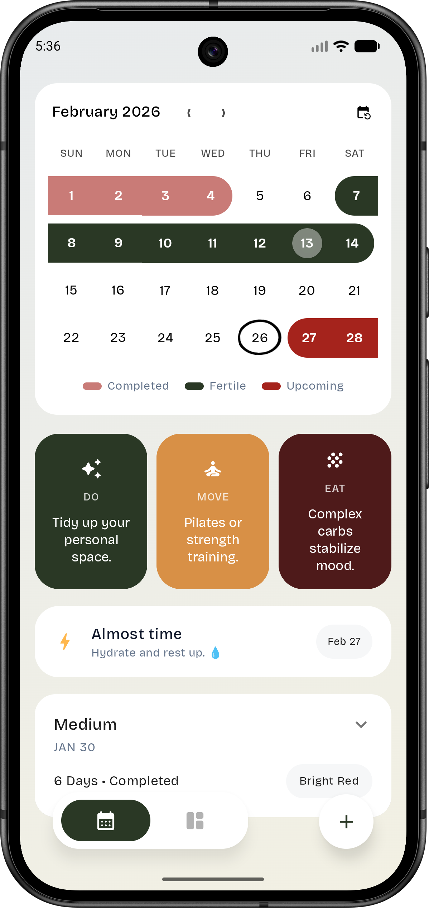
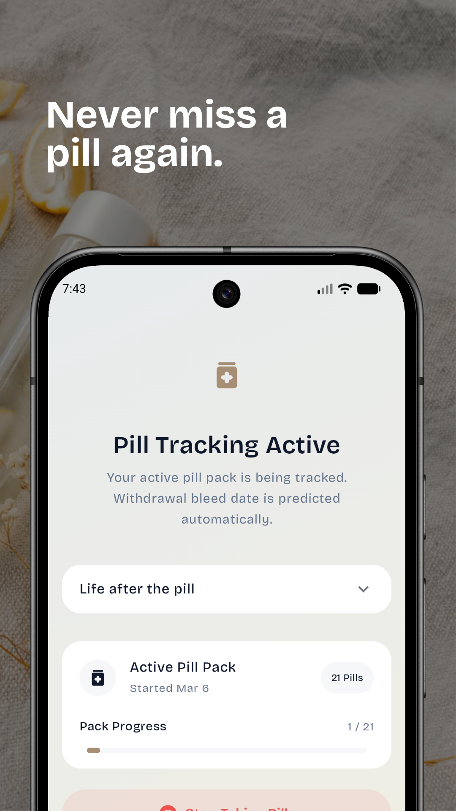
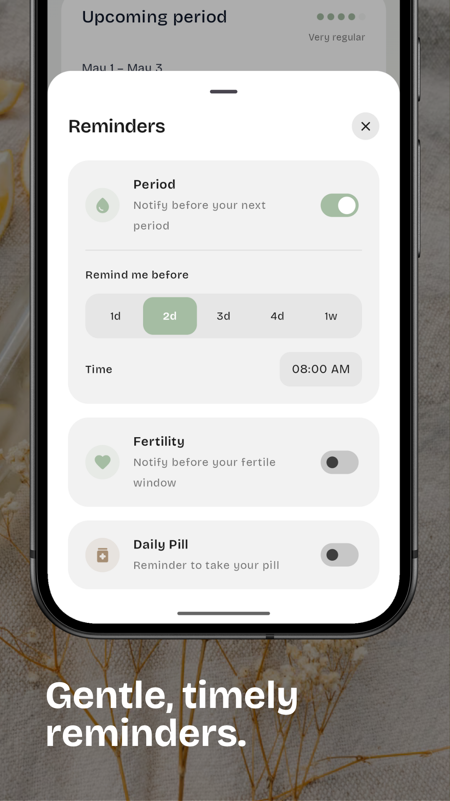

  

<h1 align="center">Periodt: Track & Predict Cycles</h1>

  Periodt is a privacy‑first Android app that keeps cycle data on the device and uses on‑device logic to predict upcoming periods, fertile windows, and ovulation estimates.

 

 

## Highlights
- Private by design: data stays on the device; no analytics, no ads, no cloud sync.
- Encrypted at rest: Room database secured with SQLCipher and Android Keystore–protected key.
- Modern Android: Jetpack Compose UI, Room, Coroutines, and a monthly home‑screen widget.
- Gentle reminders: optional notifications to stay on top of cycles.
- Offline: no internet permission required.

## How it works
- Prediction: simple on‑device calculations using recent entries and cycle length.
- Storage: per‑install passphrase, wrapped by Android Keystore, unlocks an encrypted Room DB.
- Widgets: RemoteViews render a responsive monthly calendar with quick navigation.

## Roadmap
- [ ] **Advanced Cycle Insights** – Statistical trends and symptom correlation analysis.
- [ ] **Automated Backups** – Support for periodic local backups to custom directories.
- [ ] **Lock Screen Support** – Privacy-focused widgets specifically for the Android Lock Screen.
- [ ] **Localization** – Expanding support for the languages currently listed as "Coming Soon."

## Contributing
Issues and pull requests are welcome. Please open an issue to discuss significant changes before submitting a PR.

## License
GNU General Public License (GPL). See [LICENSE](./LICENSE) for details.

## Developer
Ben
- Contact: developer.ben10@gmail.com
