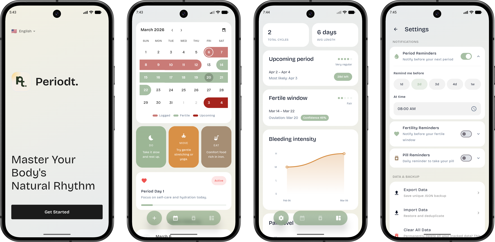

  

<h1 align="center">Periodt: Track & Predict Cycles</h1>

  Periodt is a privacy‑first Android app that keeps all cycle data on the device and uses on‑device logic to predict upcoming periods, fertile windows, and ovulation estimates — with full pill tracking and post-pill recovery awareness.

 

  

 

  <a href="https://apps.obtainium.imranr.dev/redirect?r=obtainium://app/%7B%22id%22%3A%22com.benny10ben.periodt%22%2C%22url%22%3A%22https%3A%2F%2Fgithub.com%2Fbenny10ben%2FPeriodt%22%2C%22author%22%3A%22benny10ben%22%2C%22name%22%3A%22Periodt%22%2C%22preferredApkIndex%22%3A0%2C%22additionalSettings%22%3A%22%7B%5C%22includePrereleases%5C%22%3Afalse%2C%5C%22fallbackToOlderReleases%5C%22%3Atrue%2C%5C%22filterReleaseTitlesByRegEx%5C%22%3A%5C%22%5C%22%2C%5C%22filterReleaseNotesByRegEx%5C%22%3A%5C%22%5C%22%2C%5C%22verifyLatestTag%5C%22%3Afalse%2C%5C%22dontSortReleasesList%5C%22%3Atrue%2C%5C%22useLatestAssetDateAsReleaseDate%5C%22%3Afalse%2C%5C%22releaseTitleAsVersion%5C%22%3Afalse%2C%5C%22trackOnly%5C%22%3Afalse%2C%5C%22versionExtractionRegEx%5C%22%3A%5C%22%5C%22%2C%5C%22matchGroupToUse%5C%22%3A%5C%22%5C%22%2C%5C%22versionDetection%5C%22%3Atrue%2C%5C%22releaseDateAsVersion%5C%22%3Afalse%2C%5C%22useVersionCodeAsOSVersion%5C%22%3Afalse%2C%5C%22apkFilterRegEx%5C%22%3A%5C%22%5C%22%2C%5C%22invertAPKFilter%5C%22%3Afalse%2C%5C%22autoApkFilterByArch%5C%22%3Atrue%2C%5C%22appName%5C%22%3A%5C%22%5C%22%2C%5C%22shizukuPretendToBeGooglePlay%5C%22%3Afalse%2C%5C%22allowInsecure%5C%22%3Afalse%2C%5C%22exemptFromBackgroundUpdates%5C%22%3Afalse%2C%5C%22skipUpdateNotifications%5C%22%3Afalse%2C%5C%22about%5C%22%3A%5C%22%5C%22%7D%22%2C%22overrideSource%22%3Anull%7D">
    
  </a>

 

> ⚠️ **Medical disclaimer:** Predictions are for informational purposes only and are not medical advice. Please consult a healthcare professional for accurate results.

## Highlights
- **Private by design** — data stays on the device; no analytics, no ads, no cloud sync.
- **Encrypted at rest** — Room database secured with SQLCipher and an Android Keystore–protected key.
- **Modern Android** — Jetpack Compose UI, Room, Coroutines, DataStore, and home‑screen widgets.
- **Pill tracker** — log contraceptive packs, track daily pills, and get withdrawal bleed predictions timed to pack end.
- **Discovery & Learning mode** — predictions pause after stopping the pill and gradually re-enable as natural cycles re-establish.
- **Smart algorithm** — trend-aware regression, outlier filtering, regularity scoring, and personalised luteal phase data.
- **Reminders** — optional notifications for period, fertile window, and daily pill, each with custom timing.
- **Offline** — no internet permission required.

## How it works

### Prediction algorithm

Periodt uses a multi-stage on-device prediction engine:

1. **Outlier filtering** — unusually long gaps (likely missed logs) are detected using the user's own median cycle length and excluded before any statistics are run.
2. **Trend-aware cycle length** — a weighted linear regression across the last 6 cycles detects whether cycles are shifting shorter or longer, blended with a recency-weighted average.
3. **Regularity scoring** — standard deviation of cycle lengths classifies the pattern as Very Regular, Regular, Somewhat Irregular, or Irregular, which directly widens or narrows the prediction window.
4. **Personalised ovulation** — ovulation is estimated from actual logged luteal phase data where available, not a fixed 14-day assumption. The fertile window expands or contracts based on confidence.
5. **Post-pill awareness** — after stopping the pill, predictions pause during Discovery (0–1 post-pill cycles) and are flagged as Learning (2–3 cycles) before returning to full Normal confidence.

## Roadmap
- [ ] **Advanced Cycle Insights** – Statistical trends and symptom correlation analysis.
- [ ] **Automated Backups** – Support for periodic local backups to custom directories.
- [ ] **Lock Screen Support** – Privacy-focused widgets specifically for the Android Lock Screen.
- [ ] **Localization** – Expanding support for additional languages.

## Contributing
Issues and pull requests are welcome. Please open an issue to discuss significant changes before submitting a PR.

## License
GNU General Public License (GPL). See [LICENSE](./LICENSE) for details.

## Developer
Built by [Benny](https://github.com/benny10ben) — [@benbytee](https://x.com/benbytee)

  
  &nbsp;&nbsp;
  
  &nbsp;&nbsp;
  

